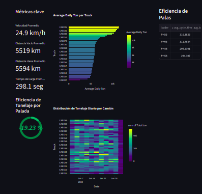

# Dashboard de Rendimiento de Camiones y Palas

Este repositorio contiene un dashboard para analizar el rendimiento de camiones y palas en términos de tonelaje y eficiencia. La aplicación está desarrollada con Streamlit y permite visualizar métricas clave y gráficos interactivos.

## Requisitos previos

- Python 3.7 o superior
- Git (para clonar el repositorio)

## Instalación

Este repositorio contiene archivos grandes que están gestionados con **Git LFS (Large File Storage)**. Para asegurarse de descargar todos los archivos correctamente, siga estos pasos:

1. **Instalar Git LFS** (si no lo tiene instalado). En la mayoría de los sistemas, puede hacerlo con:

   ```bash
   git lfs install
   ```
> [!IMPORTANT]   
> Sin Git LFS, algunos archivos grandes aparecerán como punteros y no se descargarán completamente.


1. **Clonar el repositorio:**

    ```bash
   git clone <URL-DEL-REPO>
   cd <NOMBRE-DEL-REPO>
    ```

2. Instalar las dependencias:
    ```bash
    pip install -r requirements.txt
    ```
   
> [!IMPORTANT]
> Copiar los datos en la carpeta data del repositorio: Asegúrate de que el archivo de datos, timeseries_data_cleaned.csv, esté ubicado en la ruta ./data/timeseries_data_cleaned.csv dentro de tu directorio de trabajo.

3. Ejecute los notebooks en orden: EDA, luego RENDIMIENTO.

## Ejecucion del dashboard
```bash
streamlit run app.py
```





